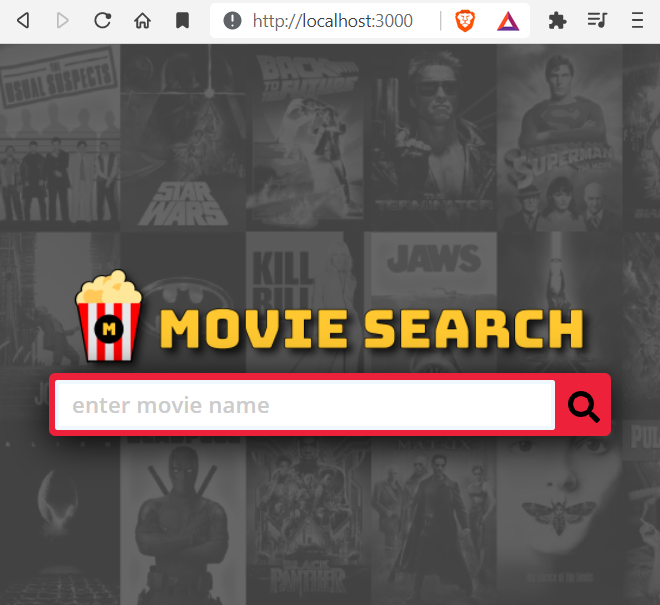

[](https://travis-ci.org/gelstudios/gitfiti) [](https://app.netlify.com/sites/rbhachu-react-movie-search/deploys)

<h1 align="center">Movie Search</h1>
<div align="center">

:rocket: **[View Live Demo](https://rbhachu-react-movie-search.netlify.app)** :rocket:<br>


</div>

## Description
<p>React Movie Search, created with React (Hooks/Effect), HTML, FlexBox, SASS, FontAwesome. Connecting to The Movie DB via a RESTful API, converted to JSON Format.</p>

## Features
**Project features:**
  <ul>
    <li>Custom Reuseable `Fetch API` Hook </li>
    <li>Dynamic Sticky Header (Un-stuck when viewing in mobile landscape orientation to maximise view <415px height)</li>
    <li>`Back-to-top` Scroll Feature</li>
    <li>Custom User-Friendly Error Messages</li>
    <li>Search Preloader Animation</li>
    <li>Fully Responsive/Mobile Optimised Layout using CSS FlexBox</li>
    <li>Flip Card Animation using CSS</li>
    <li>`Null Image` Image Place Holder</li>
    <li>`Top Movie Search` Deep Links</li>
    <li>Pop-out Burger Menu with Transitions</li>
    <li>Custom Fav Ico</li>
    <li>FontAwesome Icons</li>
    <li>PWA Enabled</li>
    <li>Continuous Deployment (CD) from GitHub Repo to Netlify Host Server</li>
  </ul>

## NPM Modules
__The following dependencies are used to run this project;__
````json
"dependencies": {
  "@fortawesome/fontawesome-svg-core": "^1.2.35",
  "@fortawesome/free-brands-svg-icons": "^5.15.3",
  "@fortawesome/free-solid-svg-icons": "^5.15.3",
  "@fortawesome/react-fontawesome": "^0.1.14",
  "@testing-library/jest-dom": "^5.14.1",
  "@testing-library/react": "^11.2.7",
  "@testing-library/user-event": "^12.8.3",
  "react": "^17.0.2",
  "react-dom": "^17.0.2",
  "react-scripts": "4.0.3",
  "web-vitals": "^0.2.4",
  "workbox-background-sync": "^5.1.4",
  "workbox-broadcast-update": "^5.1.4",
  "workbox-cacheable-response": "^5.1.4",
  "workbox-core": "^5.1.4",
  "workbox-expiration": "^5.1.4",
  "workbox-google-analytics": "^5.1.4",
  "workbox-navigation-preload": "^5.1.4",
  "workbox-precaching": "^5.1.4",
  "workbox-range-requests": "^5.1.4",
  "workbox-routing": "^5.1.4",
  "workbox-strategies": "^5.1.4",
  "workbox-streams": "^5.1.4"
},
"devDependencies": {
  "sass": "^1.36.0"
}
````

## Installation Instructions
<p>Open your Code Editor and 'CD' into your working directory, then download the repo to that location.<p>

```sh
git clone https://github.com/rbhachu/movie-search
```
<p>Once the repo has been downloaded, 'CD' to the newly downloaded project folder; 'cd movie-search'.<p>

```sh
npm install
```
<br>

----------
### The Movie Database API
In order to run the site you will need to register to aquire a free API Key from The Movie Database, which is the service provider for the Movie information data we will be connecting to aquire.<br>
[TMDB FREE API Link](https://www.themoviedb.org/documentation/api)
<br>
<br>

----------
### .env file (file path: ./.env/)
<p>Once you have aquired the API Key from TMDB, you will need to update the .env file (situated in the root of the site folder) with the API key value.<br>

_Replace `xxxxx` with your API Key_

</p>

````env
REACT_APP_API_KEY="xxxxx"
````
<p>
<br>

----------

## Usage Instructions
<p>Finally, to run the project, simply execute the following command in your terminal (ensuring you are in the correct project directory too).</p>

```sh
npm start
```
<p>After a few seconds, your browser should automatically open to the following link and display the project in your default browser;

[http://localhost:3000](http://localhost:3000)
</p>


<br>
<br>

----------
## Author
👤 **Rishi Singh Bhachu**<br>
<a target="_blank" title="https://www.bhachublog.com" href="https://www.bhachublog.com"></a>
<a target="_blank" title="https://www.linkedin.com/in/RishiSinghBhachu/" href="https://www.linkedin.com/in/RishiSinghBhachu/"></a>


## Issues
Please drop me a message if you have any issues or problems running the project.


## Show your support
Give a ⭐️ if this project helped you!